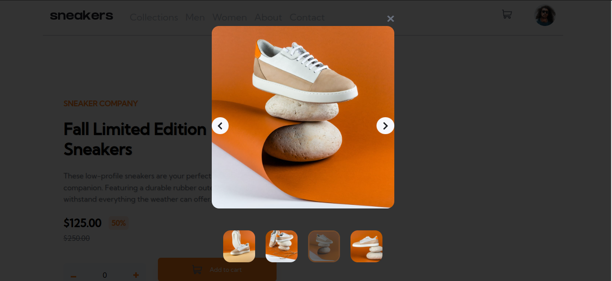

# Frontend Mentor - E-commerce product page solution

This is a solution to the [E-commerce product page challenge on Frontend Mentor](https://www.frontendmentor.io/challenges/ecommerce-product-page-UPsZ9MJp6). Frontend Mentor challenges help you improve your coding skills by building realistic projects.

## Table of contents

- [Overview](#overview)
  - [The challenge](#the-challenge)
  - [Screenshot](#screenshot)
  - [Links](#links)
- [My process](#my-process)
  - [Built with](#HTML,CSS and Vanilla Js)
  - [What I learned](#i learnt mobile first design )

### The challenge

Users should be able to:

- View the optimal layout for the site depending on their device's screen size
- See hover states for all interactive elements on the page
- Open a lightbox gallery by clicking on the large product image
- Switch the large product image by clicking on the small thumbnail images
- Add items to the cart
- View the cart and remove items from it

### Screenshot

### Links

- Solution URL: [Add solution URL here](https://your-solution-url.com)
- Live Site URL: [live URl](https://ecommui.netlify.app/)

## My process

### Built with

- Semantic HTML5 markup
- CSS custom properties
- Flexbox
- CSS Grid

### What I learned
i learnt how functions work work; 
function call before and update in say  a count and function call after a count doesn't give sam results.
i learnt how to create hoverlike states with javascript
the code is show bellow
closeModal.addEventListener("mouseenter", () => {
  closeModal.src = hoveredImage;
});
closeModal.addEventListener(
  "mouseleave",
  () => (closeModal.src = "./images/icon-close.svg")
);
closeModal.addEventListener("click", (e) => {
  removeModal(e);
  closeModal.src = "./images/icon-close.svg";
});

code ends here

code snipets:
 // this function clears all active states on the images before swaping and after swapping
const clearAllActive = () => {
  thumbnails.forEach((thumb) => thumb.classList.remove("active"));
};
//  this function swaps the immages on small screens
function swapThumbs() {
  thumbnails.forEach((thumb, index) => {
    thumb.addEventListener("click", () => {
      clearAllActive();
      //
      //
      count = index;
      changeImage();
      thumb.classList.add("active");
    });
  });
}
swapThumbs();

### Continued development

<!--  -->

### Useful Resources

MDN Docs 
W3Schools

## Author

- Website - [Isaac Sakyi](https://ecommui.netlify.app/)
- Frontend Mentor - [@isaac-svg](https://www.frontendmentor.io/profile/yourusername)

